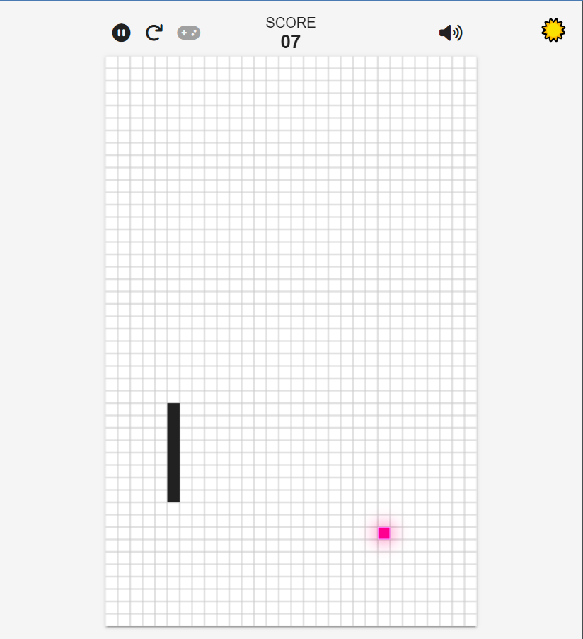
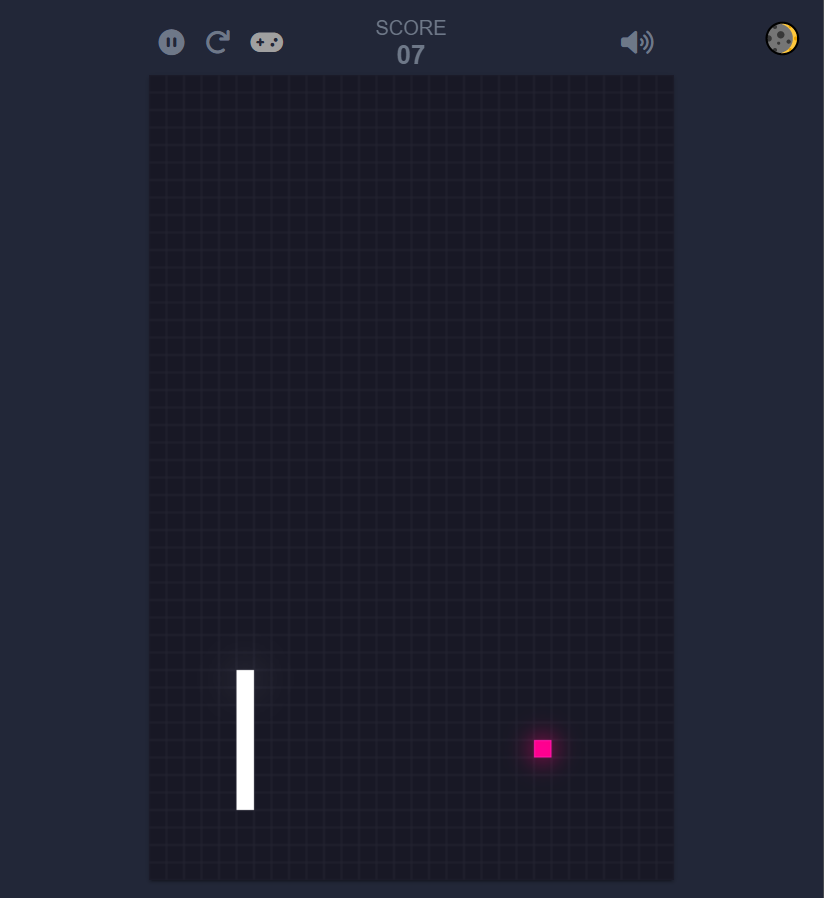

<h1 align="center">
    Snake Game
</h1>

<p align="center">
  <a href="https://nodejs.org/en/" target="_blank">
    
  </a>
  <a href="https://www.angular.io.com/" target="_blank">
    
  </a>
  <a href="https://www.linkedin.com/in/gustavodomingueti/" target="_blank">
    
  </a>
  <a href="LICENSE.md" target="_blank">
    
  </a>
</p>

<p align="center">
  <a href="#sobre">Sobre</a>&nbsp;&nbsp;&nbsp;|&nbsp;&nbsp;&nbsp;
  <a href="#tecnologias-utilizadas">Tecnologias</a>&nbsp;&nbsp;&nbsp;|&nbsp;&nbsp;&nbsp;
  <a href="#pre-requisitos">Pré-requisitos</a>&nbsp;&nbsp;&nbsp;|&nbsp;&nbsp;&nbsp;
  <a href="#como-usar">Como usar</a>&nbsp;&nbsp;&nbsp;|&nbsp;&nbsp;&nbsp;
  <a href="#como-contribuir">Como contribuir</a>&nbsp;&nbsp;&nbsp;|&nbsp;&nbsp;&nbsp;
  <a href="#license">Licença</a>
</p>

<a id="sobre"></a>

## :bookmark: Sobre

Jogo criado no intuito de reforçar alguns aprendizados nas tecnologias mas utilizadas da Web.

<a id="tecnologias-utilizadas"></a>

## :rocket: Tecnologias Utilizadas

Construído totalmente em **Javascript**, **CSS3**, **HTML5** e **Canvas**.

<a id="screens"></a>

## :iphone: Screens

<h4 align="center">
    
</h4>

<h4 align="center">
    
</h4>

<a id="pre-requisitos"></a>

## :fire: Pré-requisitos

- [Node.js](https://nodejs.org/)
- [Npm](https://www.npmjs.com/)

<a id="como-usar"></a>

## :zap: Como usar

```bash
  # Clone o repositório
  $ git clone git@github.com:dominguetigs/snake-game.git

  # Instale as dependências
  $ npm install

  # Inicie o jogo
  $ npm start
```

<a id="como-contribuir"></a>

## :recycle: Como contribuir

- Faça um Fork desse repositório

```bash
  # Crie uma branch com a sua feature
  $ git checkout -b my-feature

  # Commit suas mudanças
  $ git commit -m 'feat: My new feature'

  # Push a sua branch
  $ git push origin my-feature
```

<a id="license"></a>

## :memo: License

Esse projeto está sob a licença MIT. Veja o arquivo [LICENSE](LICENSE) para mais detalhes.

---

<h4 align="center">
    Feito com 💙 by <a
      href="https://www.linkedin.com/in/gustavodomingueti/"
      target="_blank"
    >Gustavo Domingueti</a>
</h4>
